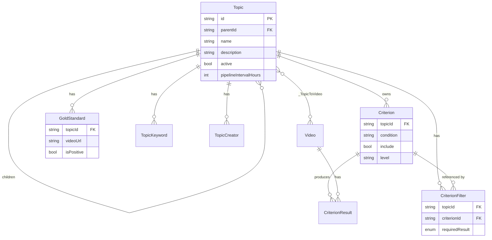
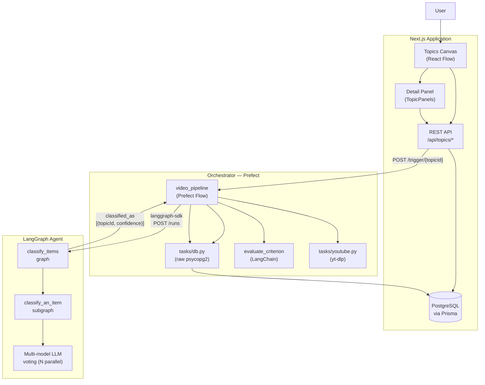
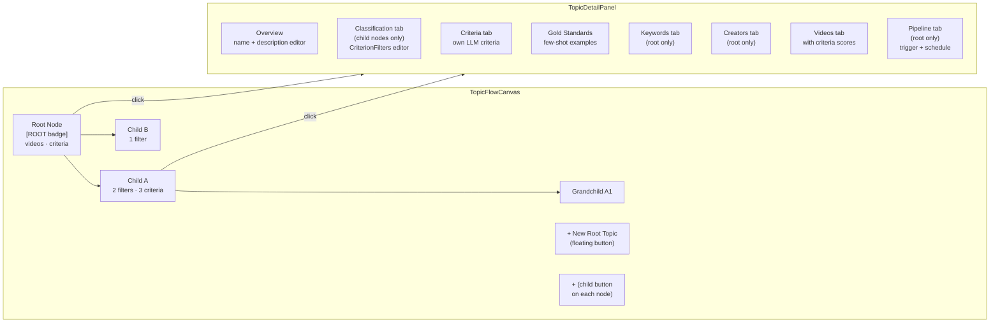
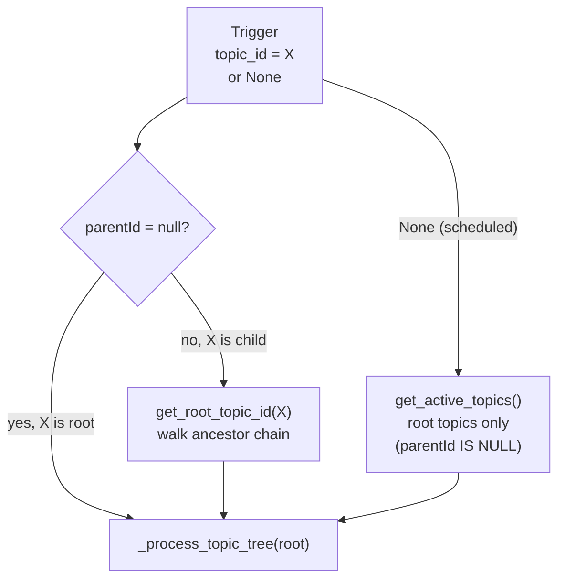
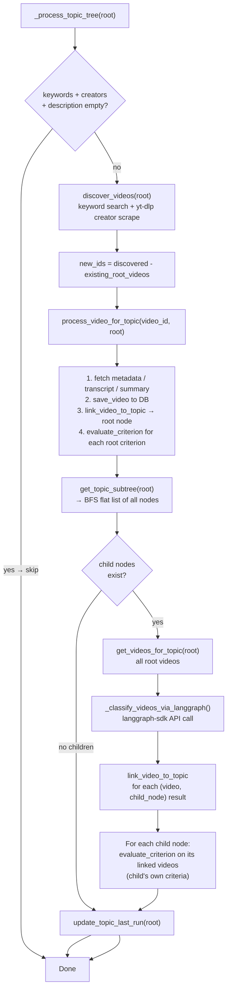
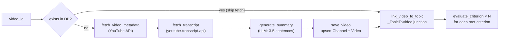
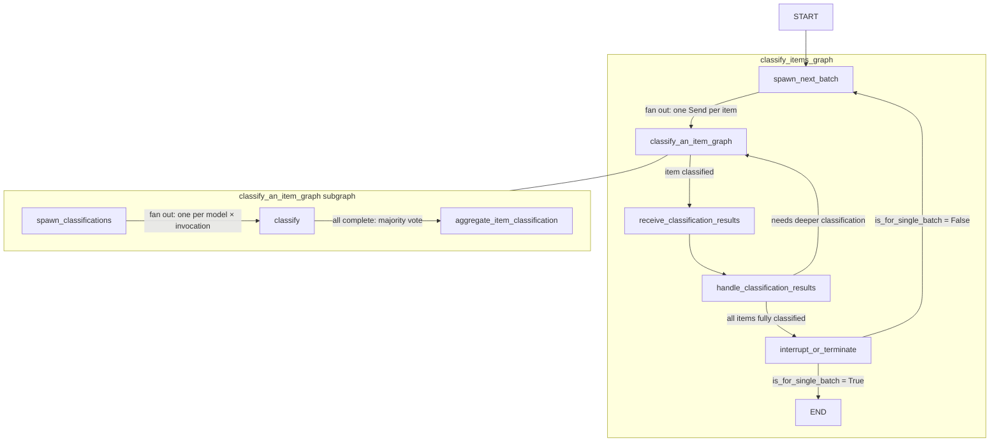
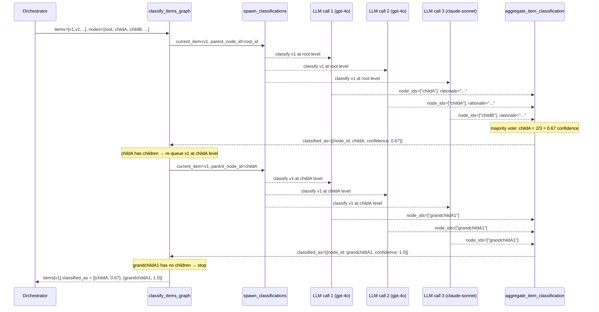
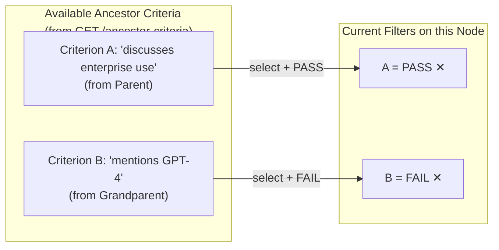
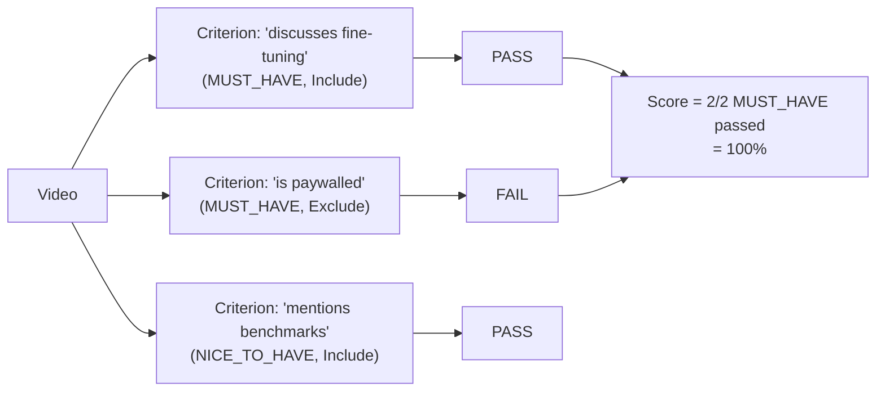

# Topic Tree Architecture

## Overview

Innie organizes content into a **tree of topic nodes** rather than a flat list. Each node represents a progressively more specific sub-category of content. Videos are discovered at the root level and then classified down through the tree using a multi-model LLM voting agent (`classify_items_graph`) deployed on LangGraph.

```
Root Topic: "AI Content"
  ├── Child A: "LLM Tutorials"
  │     ├── Grandchild A1: "Beginner LLM Guides"
  │     └── Grandchild A2: "Advanced LLM Research"
  └── Child B: "AI Tools & Products"
        └── Grandchild B1: "Open Source AI Tools"
```

---

## 1. Data Model

### Topic Tree (Prisma Schema)

```
┌─────────────────────────────────────────────────────────────────┐
│  Topic                                                           │
│  ─────────────────────────────────────────────────────────────  │
│  id                    String  (cuid)                            │
│  name                  String                                    │
│  description           String?   ← used as LLM classification   │
│                                    prompt for this node          │
│  parentId              String?   ← null = root node             │
│  active                Boolean                                   │
│  pipelineIntervalHours Int                                       │
│  lastPipelineRunAt     DateTime?                                 │
│                                                                  │
│  parent         Topic?           (self-referential)              │
│  children       Topic[]          (self-referential)              │
│  criteria       Criterion[]      (own LLM-evaluated criteria)    │
│  criterionFilters CriterionFilter[] (routing rules)             │
│  goldStandards  GoldStandard[]   (few-shot examples per node)   │
│  keywords       TopicKeyword[]   (root only: discovery)         │
│  creators       TopicCreator[]   (root only: discovery)         │
│  videos         Video[]          (many-to-many)                  │
└─────────────────────────────────────────────────────────────────┘
```

The tree is stored as a **flat list with a `parentId` foreign key** — the same pattern used in `self_evolving_taxonomy_agent`. This makes BFS/DFS traversal straightforward in SQL.

### CriterionFilter

A child node can optionally declare explicit filter rules using criteria evaluated on the parent:

```
┌──────────────────────────────────────────────────────┐
│  CriterionFilter                                     │
│  ──────────────────────────────────────────────────  │
│  topicId        String   ← the child topic           │
│  criterionId    String   ← any ancestor's criterion  │
│  requiredResult PASS | FAIL | CANNOT_TELL            │
│                                                      │
│  @@unique([topicId, criterionId])                    │
└──────────────────────────────────────────────────────┘
```

**Example:** Child node "Enterprise AI" has the filter `{criterion: "discusses enterprise use cases", requiredResult: PASS}`. Only videos that received `PASS` for that criterion (evaluated on the parent) enter this child.

### Entity Relationship



---

## 2. System Architecture



---

## 3. React Flow Canvas UI

The topics list page (`/settings/topics`) is a **React Flow canvas** with a right-side detail panel.



### Node Card

Each node in the canvas displays:
- Node name
- `ROOT` or child badge
- Active/Paused status
- Video count
- Criteria count
- Filter count (child nodes)

Clicking **+** on any node creates a new child topic via `POST /api/topics` with `parentId`.

---

## 4. Pipeline Flow

### Triggering



Triggering from any node (root or child) always processes from the **root downward**. Child-triggered runs skip updating `lastPipelineRunAt` on the root so the scheduler is not affected.

### Full Pipeline Execution



### process_video_for_topic Detail



---

## 5. classify_items LangGraph Agent

The agent lives in `agents/` and is deployed separately on LangGraph. The orchestrator calls it via `langgraph-sdk` after videos are discovered and saved.

### Input / Output Contract

```
Input (ClassifyItemsOverallState):
  taxonomy:           { id, name, aspect: root_topic.description }
  root_node_id:       root_topic.id
  nodes:              [ ClassNodeState × all topic nodes in subtree ]
  items:              [ ItemState × all videos in root topic ]
  models:             [ "gpt-4o", ... ]         # from CLASSIFY_MODELS env
  total_invocations:  3                          # from CLASSIFY_TOTAL_INVOCATIONS
  majority_threshold: 0.5                        # from CLASSIFY_MAJORITY_THRESHOLD
  is_for_single_batch: true

Output (items[].classified_as):
  [ { node_id: "child_topic_id", confidence_score: 0.83 }, ... ]
```

**ClassNodeState mapping:**

| Prisma `Topic` field | `ClassNodeState` field |
|---|---|
| `id` | `id` |
| `parentId` (or `""`) | `parent_node_id` |
| `name` | `label` |
| `description` | `description` |
| `goldStandards` video IDs | `items[].item_id` (few-shot examples) |

**ItemState mapping:**

| `VideoData` | `ItemState` |
|---|---|
| `video_id` | `id` |
| `"Title: {title}\nChannel: {channel}\nSummary: {summary}"` | `content` |

### Graph Structure



### Multi-Model Voting (classify_an_item subgraph)

For each video at each tree level, the subgraph runs **N parallel LLM calls** across configured models:



The orchestrator then calls `link_video_to_topic(v1, childA)` and `link_video_to_topic(v1, grandchildA1)`.

### Recursive Depth Handling

The recursion is driven by the `handle_classification_results` node. After each round of classification, it checks `cases_need_further_classification` — a list of `{parent_node_id: item}` pairs where the classified node has its own children. These are re-dispatched via `Send` for the next level of classification. This continues until all videos reach leaf nodes or fail to match any child.

```
Round 1:  all items → classify at root level
Round 2:  items that landed on non-leaf nodes → classify at their level
Round 3:  items that landed on non-leaf nodes at level 2 → classify further
...until no cases_need_further_classification remain
```

---

## 6. CriterionFilters Editor (UI)

Child nodes can optionally have explicit routing rules that supplement LLM classification. The **Classification tab** in the detail panel (visible on child nodes only) lets users add `CriterionFilter` records:



The filters are stored in `CriterionFilter` and are currently used for UI documentation of intended routing logic. The actual runtime routing is performed by the LangGraph agent using the node descriptions.

---

## 7. Criteria Evaluation

Each topic node has its **own `Criterion[]`** evaluated independently by the existing `evaluate_criterion` task (LangChain, single LLM call). These are used for **scoring and display** in the Videos tab — they do not control routing.



`NICE_TO_HAVE` criteria are evaluated but excluded from the score. `include=false` criteria invert the pass condition (a video passes if the criterion result is `FAIL`).

---

## 8. Gold Standards (Few-Shot Examples)

Each topic node can have `GoldStandard` records — YouTube URLs marked as positive or negative examples. These serve a dual purpose:

1. **Criterion evaluation:** Prepended as few-shot human/AI message pairs in the `evaluate_criterion` prompt (positive → expected `PASS`, negative → expected `FAIL`).
2. **LangGraph classification:** Gold standard video IDs are attached to each `ClassNodeState.items` as `used_as_few_shot_example: true`. The `format_single_node` formatter includes their content (title + summary) in the LLM prompt under "Exemplary Items".

Gold standards are **per-node**, meaning each child node can have its own examples that define what content belongs there.

---

## 9. Environment Variables

| Variable | Where Used | Description |
|---|---|---|
| `LANGGRAPH_API_URL` | `orchestrator/config.py` | LangGraph server URL (default `http://localhost:2024`) |
| `LANGGRAPH_API_KEY` | `orchestrator/config.py` | LangGraph Cloud API key (optional for local) |
| `CLASSIFY_MODELS` | `orchestrator/config.py` | Comma-separated model names, e.g. `gpt-4o,claude-3-5-sonnet-latest` |
| `CLASSIFY_TOTAL_INVOCATIONS` | `orchestrator/config.py` | Total LLM calls per item per level (default `3`) |
| `CLASSIFY_MAJORITY_THRESHOLD` | `orchestrator/config.py` | Fraction of votes needed to include a node (default `0.5`) |
| `DEFAULT_LLM_MODEL` | `orchestrator/config.py` | Model for `evaluate_criterion` and `generate_summary` |
| `POSTGRES_URL` | both `orchestrator` and `agents` | Neon PostgreSQL connection string |

---

## 10. Running Locally

### LangGraph Agent (development)

```bash
cd agents
uv run langgraph dev
# Serves at http://localhost:2024
# Studio UI at https://smith.langchain.com/studio
```

### Orchestrator

```bash
cd orchestrator
uv run uvicorn server:app --port 8200
# Trigger manually: POST /trigger/{topicId}
```

Or via Prefect:

```bash
cd orchestrator
uv run python flows/video_pipeline.py
```

### Application

```bash
cd application
npm run dev
# http://localhost:3000
# Topics canvas: /settings/topics
```

---

## 11. File Map

```
innie/
├── agents/                          # LangGraph agent (deployed separately)
│   ├── langgraph.json               # deployment config → classify_items graph
│   ├── pyproject.toml               # langgraph, langchain-openai, langchain-anthropic
│   ├── state.py                     # ClassifyItemsOverallState, ClassNodeState, ItemState
│   ├── llm_factory.py               # LLMFactory: parallel async multi-model calls
│   ├── utils.py                     # node/item formatting, majority vote logic
│   ├── common.py                    # MemorySaver checkpointer, retry policy
│   └── classify_items/
│       ├── classify_items_graph.py  # outer graph: batch dispatch + result handling
│       └── subgraphs/
│           └── classify_an_item.py  # inner subgraph: N parallel LLM calls + voting
│
├── orchestrator/                    # Prefect pipeline
│   ├── config.py                    # env vars incl. LANGGRAPH_API_URL
│   ├── server.py                    # FastAPI trigger server
│   ├── flows/
│   │   └── video_pipeline.py        # main pipeline: discover → eval → classify
│   ├── tasks/
│   │   ├── db.py                    # psycopg2 SQL: get_topic_subtree, link_video_to_topic, ...
│   │   ├── evaluate.py              # LangChain: evaluate_criterion, generate_summary
│   │   └── youtube.py               # yt-dlp: search, fetch metadata, transcript
│   └── models/
│       ├── _generated.py            # auto-generated from schema.prisma
│       └── schemas.py               # enriched Topic (with children, criterion_filters)
│
└── application/                     # Next.js app
    ├── prisma/schema.prisma         # Topic tree: parentId, CriterionFilter model
    ├── app/api/topics/
    │   ├── route.ts                 # GET (flat list + parentId), POST (accepts parentId)
    │   └── [topicId]/
    │       ├── route.ts             # includes children, criterionFilters
    │       ├── criterion-filters/
    │       │   ├── route.ts         # GET + POST criterion filters
    │       │   └── [filterId]/route.ts  # DELETE
    │       └── ancestor-criteria/
    │           └── route.ts         # GET all ancestor criteria (for filter editor)
    └── components/topic/
        ├── TopicFlowCanvas.tsx      # React Flow + dagre auto-layout
        ├── TopicNode.tsx            # custom React Flow node card (not yet extracted)
        ├── TopicDetailPanel.tsx     # right-side panel (fetches topic on click)
        ├── TopicPanels.tsx          # tab bar: Classification/Criteria/Videos/Pipeline/...
        └── CriterionFiltersEditor.tsx  # ancestor criteria selector + filter CRUD
```
