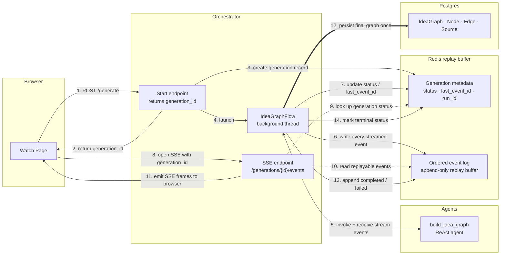

# Idea Graph Implementation

Per-user idea graph on the video watch page, generated from the video transcript and streamed to the browser in real time.

## Architecture

The feature spans three services in the monorepo.

- **`application`** — watch page, graph editor, app API routes
- **`orchestrator`** — generation flow, Redis event buffering, SSE delivery, final DB write
- **`agents`** — LangGraph agent that builds the graph incrementally

## Generation Flow

1. User clicks **Generate idea graph**.
2. `application` calls `POST /idea-graph/generate` on the orchestrator and receives a `generationId`.
3. `application` opens an `EventSource` to the orchestrator SSE endpoint for that generation.
4. `orchestrator` prepares transcript context and starts the LangGraph run in a background thread.
5. The `build_idea_graph` agent reads transcript chunks and builds the graph through tool calls, emitting a custom stream event for every mutation.
6. `orchestrator` consumes those events, appends them to a Redis event log, and relays them to the browser over SSE.
7. The browser applies each event to local graph state and re-renders immediately.
8. When LangGraph finishes, `orchestrator` validates the final `result_graph`, writes it to Postgres once, and emits a terminal `completed` event.
9. On `completed`, the browser closes the SSE connection and fetches the canonical graph from the app API.
10. If the page is reloaded after completion, the DB snapshot is the source of truth.

## Streaming, Redis Replay, and DB Persist

The important boundary is:

- `IdeaGraphFlow` does not push directly to the browser.
- `IdeaGraphFlow` writes stream events into Redis.
- The SSE endpoint reads Redis and turns those records into SSE frames for the browser.

After `completed`, the browser fetches the canonical graph via the app API (`GET /idea-graph -> Postgres`).

| Path | Transport | Source |
|---|---|---|
| Live incremental updates | SSE from orchestrator | LangGraph stream via Redis |
| Disconnected client replay | SSE from orchestrator | Redis event log |
| Durable canonical graph | HTTP GET from app API | Postgres — written once at completion |

## Stream Events

Each event carries `generation_id`, `event_id`, `user_id`, `video_id`, `timestamp`, `type`, and `payload`.

| Type | When |
|---|---|
| `generation_started` | generation begins |
| `chunk_index_ready` | transcript chunk list prepared |
| `chunk_read` | agent reads a transcript chunk |
| `node_added` | agent creates a node |
| `node_updated` | agent edits an existing node |
| `edge_added` | agent creates an edge |
| `source_attached` | agent attaches a transcript source to a node |
| `snapshot` | periodic full graph snapshot for recovery |
| `completed` | final graph persisted to Postgres |
| `failed` | generation failed with error |

## Redis Buffering

Redis stores transient event data only. Postgres remains the durable graph store.

Key shapes:

- `idea_graph:generation:{generation_id}:meta` — status, `last_event_id`, `thread_id`, `run_id`
- `idea_graph:generation:{generation_id}:events` — ordered append-only event list
- `idea_graph:active:{user_id}:{video_id}` — lookup for active in-progress generation

Terminal generations are expired from Redis with a TTL after the `completed` or `failed` event is written.

## Database Model

Stored in Prisma under the `application` schema.

### Tables

- **`IdeaGraph`** — one row per `userId + videoId`, stores `generationStatus`, `generationError`, `generatedAt`, `layoutDirection`, `visibleDepth`
- **`IdeaGraphNode`** — `type`, `title`, `content`, `x`, `y`, `collapsed`
- **`IdeaGraphEdge`** — `sourceNodeId`, `targetNodeId`, `type`, `label`
- **`IdeaGraphNodeSource`** — `paraphrase`, `quote`, `startSec`, `endSec`

Both graph content and view settings (`layoutDirection`, `visibleDepth`) are persisted in Postgres.

## Application Layer

### Watch page

`WatchPageClient.tsx` renders the player, sidebar, and the full-width idea graph section below. It coordinates player seeking from graph interactions and positions the floating mini-player inside the canvas.

### Idea graph editor

`IdeaGraphSection.tsx` is the core editor. It handles:

- starting generation and subscribing to SSE
- applying streamed events to local graph state
- reconnecting and replaying missed events after a disconnect
- rendering the React Flow canvas
- auto-fitting the canvas as new nodes appear during streaming
- resetting visible depth to the current max as the graph grows during streaming
- persisting graph edits
- Dagre layout and arrange
- node/edge selection and inspector editing
- depth filtering and layout direction switching
- disabling editing while generation is in progress

### Serialization

- `application/lib/idea-graph.ts` — graph payload shape shared between routes and the frontend
- `application/lib/idea-graph-stream.ts` — stream event types and reducer-style helper that applies streamed updates to in-memory graph state

### Application API routes

**`/api/videos/[videoId]/idea-graph`**

- `GET` — fetch current persisted graph
- `PUT` — replace full graph contents
- `PATCH` — update view settings (`layoutDirection`, `visibleDepth`)
- `DELETE` — delete graph

**`/api/videos/[videoId]/idea-graph/generate`**

- `POST` — start generation; returns `generationId` and SSE URL
- `GET` — return active in-progress generation for resume/reconnect after reload

## Orchestrator Layer

The orchestrator is the execution bridge between the application and LangGraph. It handles streaming, Redis buffering, SSE delivery, and final Postgres persistence.

### Main files

- `orchestrator/flows/idea_graph.py` — generation flow
- `orchestrator/server.py` — HTTP and SSE endpoints
- `orchestrator/utils/idea_graph_events.py` — Redis event log and generation metadata helpers
- `orchestrator/tasks/db.py` — Postgres read/write helpers
- `orchestrator/tasks/youtube.py` — transcript segment fetching
- `orchestrator/models/schemas.py` — typed payloads for generation and streaming

### Orchestrator endpoints

- `POST /idea-graphs/generate` — starts generation, returns `generation_id`
- `GET /idea-graphs/generations/active` — returns the active generation for a `user_id + video_id`
- `GET /idea-graphs/generations/{generation_id}/events` — SSE stream; replays buffered events then tails live ones

## Agents Layer

The `build_idea_graph` LangGraph graph is registered in `agents/langgraph.json` and implemented in `agents/agents/idea_graph/build_idea_graph_graph.py`.

### Agent behavior

- reads transcript chunks progressively via tool calls
- maintains an in-memory `IdeaGraphContext` that accumulates nodes and edges
- emits a custom stream event (`get_stream_writer()`) for every mutation: `node_added`, `edge_added`, `source_attached`, `node_updated`
- emits a `snapshot` every five mutations and once at the end
- returns the final accumulated graph as `result_graph`

### Node types

`CLAIM`, `EVIDENCE`, `COUNTERARGUMENT`, `REBUTTAL`, `EXAMPLE`, `ASSUMPTION`, `DEFINITION`, `QUESTION`, `CONCLUSION`

### Edge types

`SUPPORTS`, `ATTACKS`, `REBUTS`, `ELABORATES`, `DEPENDS_ON`, `ILLUSTRATES`, `CONTRASTS_WITH`

## Layout

Layout uses Dagre (`nodesep: 80`, `ranksep: 130`) in `IdeaGraphSection.tsx`.

During generation, Dagre is applied to the streamed in-memory graph on each update so nodes are visible and arranged immediately. After generation completes, the persisted layout is loaded from Postgres.

`Arrange` re-runs Dagre on demand and persists the result. Changing the layout direction also triggers an automatic arrange.

## Save Strategy

Saves use batched Prisma `createMany` for nodes, sources, and edges inside a single transaction with an extended timeout. This avoids `P2028` timeouts that occurred with large graphs when rows were inserted individually.

## Notes

- Graph is private per user and tied to a single video.
- Regeneration fully replaces the existing graph.
- Editing is fully available once generation completes.
- Future directions: incremental subgraph regeneration, per-node comment threads, richer mini-player interactions.
