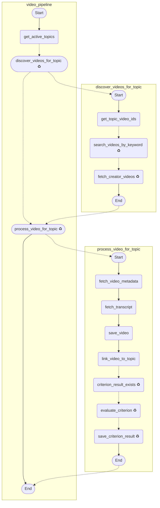

```mermaid
flowchart TB
    subgraph video_pipeline
        direction LR
        video_pi_start([Start]) --> video_pi_0(get_active_topics)
        video_pi_0 -.-> video_pi_1([discover_videos_for_topic ♻])
        video_pi_1 -.-> video_pi_2([process_video_for_topic ♻])
        video_pi_2 --> video_pi_end([End])
    end

    video_pi_1 -.-> discover_start
    discover_end -.-> video_pi_2

    subgraph discover_videos_for_topic
        direction LR
        discover_start([Start]) --> discover_0(get_topic_video_ids)
        discover_0 -.-> discover_1(search_videos_by_keyword ♻)
        discover_1 -.-> discover_2(fetch_creator_videos ♻)
        discover_2 --> discover_end([End])
    end

    video_pi_2 -.-> process__start
    process__end -.-> video_pi_end

    subgraph process_video_for_topic
        direction LR
        process__start([Start]) --> process__0(fetch_video_metadata)
        process__0 --> process__1(fetch_transcript)
        process__1 --> process__2(save_video)
        process__2 --> process__3(link_video_to_topic)
        process__3 -.-> process__4(criterion_result_exists ♻)
        process__4 -.-> process__5(evaluate_criterion ♻)
        process__5 -.-> process__6(save_criterion_result ♻)
        process__6 --> process__end([End])
    end
```
